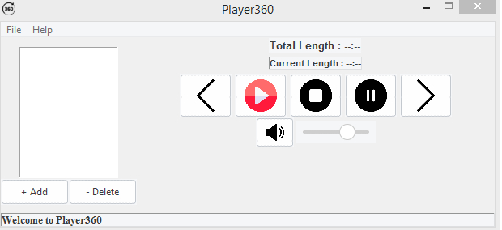

## Player360

MusicPlayer is an open source music player for Windows.safe and light

## Setup Installer for Windows

download from [Setup.exe](https://gofile.io/d/AJrNSG)

## msi Installer

download from [Player360Player360-1.0-amd64.msi](https://gofile.io/d/AJrNSG)

## Modules

It make by python
module use :

- Tkinter
- Pygame
- Os
- Mutagen
- Time
- Threading
- ttkthemes
